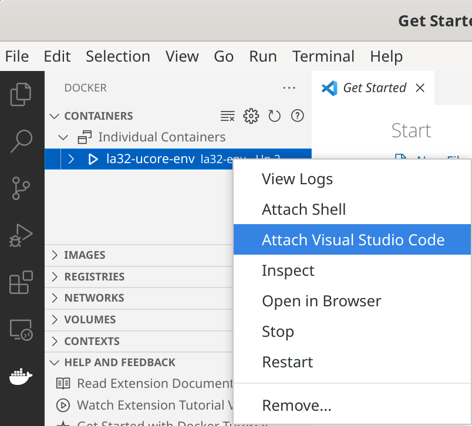

## 准备工作

环境准备：x86-64架构的Docker运行环境。

因为LoongArch32的环境配置比较复杂，尤其是它的QEMU需要补充大量依赖，因此助教为了节省同学们的工作量打包了一个Docker镜像，它封装了所有运行我们的uCore实验所需的环境，[并已发布到Docker Hub](https://hub.docker.com/r/chenyy/la32r-env).

这里推荐使用Windows的同学使用WSL2或Linux虚拟机安装Docker，使用Linux的同学直接安装即可，使用macOS（含Apple Silicon）的同学使用Linux虚拟机安装Docker。

常见Linux发行版安装Docker方法可参考[清华镜像站上的教程](https://mirrors.tuna.tsinghua.edu.cn/help/docker-ce/)。

### 对于使用的电脑非x86-64架构的同学

如果同学们使用非x86-64架构的计算机进行实验，例如使用ARM架构的Apple Silicon的Mac甚至是树莓派，可以使用虚拟机安装一个自己指令集架构的Linux发行版（对于ARM推荐Debian，作为Ubuntu的上游软件支持较丰富），然后执行以下命令安装qemu-user模拟x86-64环境，就可以在Linux中运行x86架构的二进制程序了：

```shell
sudo apt install qemu-user qemu-user-static binfmt-support gcc-x86-64-linux-gnu binutils-x86-64-linux-gnu binutils-x86-64-linux-gnu-dbg build-essential
```

之后的操作与x86-64的Linux完全相同。

## 配置Docker（可选）

1. 配置镜像站

    对于许多同学的网络环境而言可能从Docker Hub官方下载较慢，这里推荐将Docker Hub改为南京大学镜像站（目前教育网内唯一Docker Hub镜像），[配置方法在此](https://mirror.nju.edu.cn/help/docker-hub).

2. 配置Docker组的用户权限

    如果同学们想要在Linux中不通过root用户（sudo）就能直接访问Docker，以及在运行于用户权限的VSCode中直接使用Docker，可以将自己的用户加入Docker创建的组中，操作如下：

    ```shell
    sudo usermod -aG docker $USER
    newgrp docker
    ```

    之后重启电脑即可全局生效，否则每次打开终端需要使用`newgrp docker`才能使权限生效。

## 下载Docker镜像并创建实验环境容器

1. 下载`chenyy/la32r-env`镜像：

    在终端执行以下命令：

    ```shell
    docker pull chenyy/la32r-env
    ```

2. 基于`chenyy/la32r-env`创建`la32r-docker`容器

    ```shell
    docker run -dit \
        --name la32r-docker \
        --user=$(id -u $USER):$(id -g $USER) \
        --net=host \
        --workdir="/home/$USER" \
        --volume="/home:/home" \
        --volume="/etc/group:/etc/group:ro" \
        --volume="/etc/passwd:/etc/passwd:ro" \
        --volume="/etc/shadow:/etc/shadow:ro" \
        --volume="/etc/sudoers.d:/etc/sudoers.d:ro" \
        -e LANG=en_US.UTF-8 \
        -e LANGUAGE=en_US.UTF-8 \
        -e LC_ALL=en_US.UTF-8 \
        chenyy/la32r-env
    ```

    这里我们对Docker进行了一些配置，简单说就是将整个/home目录在主机与Docker容器之间共享，从而Docker能够直接访问用户文件。同时将用户与组权限进行同步，方便在Docker中直接访问对应的文件。

3. 启动`la32r-docker`容器

    ```shell
    docker start la32r-docker
    ```

4. 进入`la32r-docker`的Shell

    ```shell
    docker exec -it la32r-docker /bin/zsh
    ```

## 配置VSCode（可选）

同学们可以在VSCode的插件中搜索Docker，并通过该插件连接到容器中完成操作。

这样我们可以直接在VSCode的插件中找到对应Docker，可以进行Attach Shell或Attch VSCode。方便我们后续在Host端的VSCode完成代码编写，并在Docker中使用对应环境完成编译与调试。

